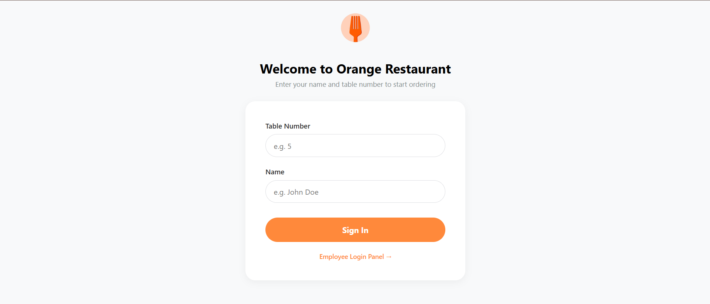
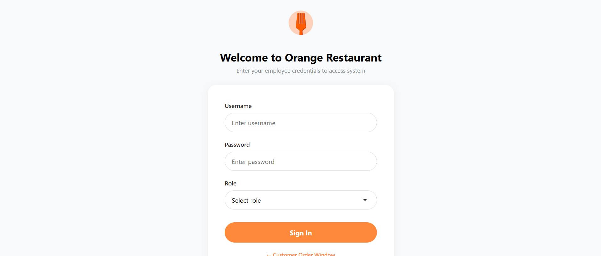
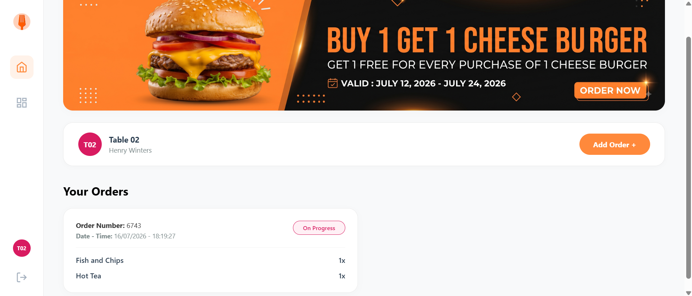
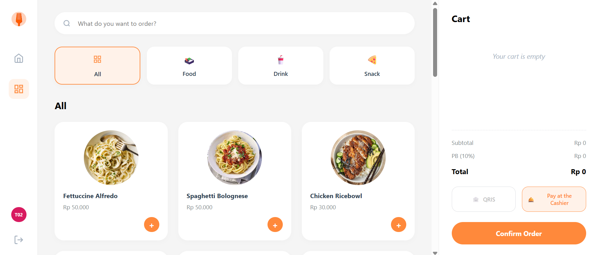
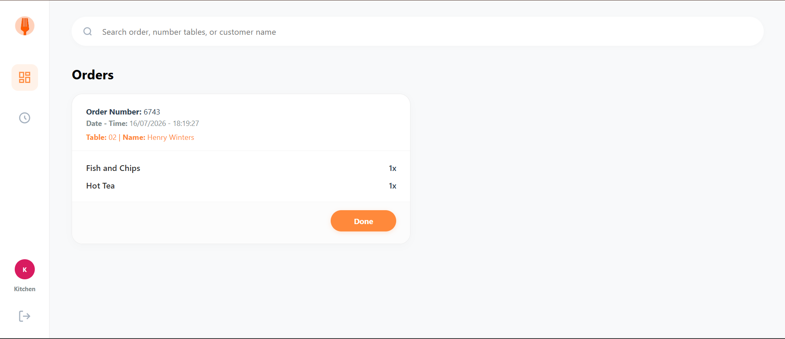
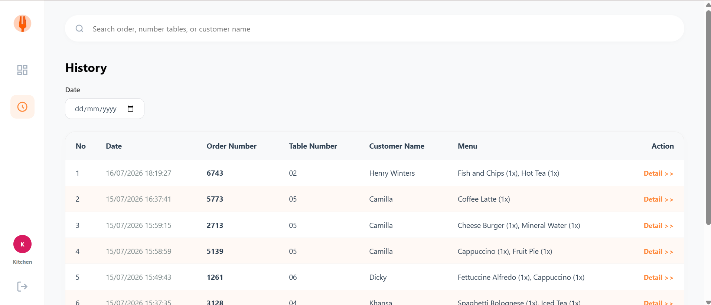
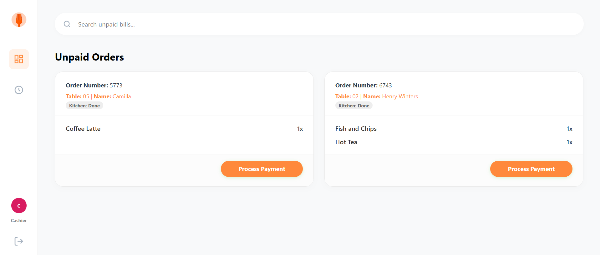
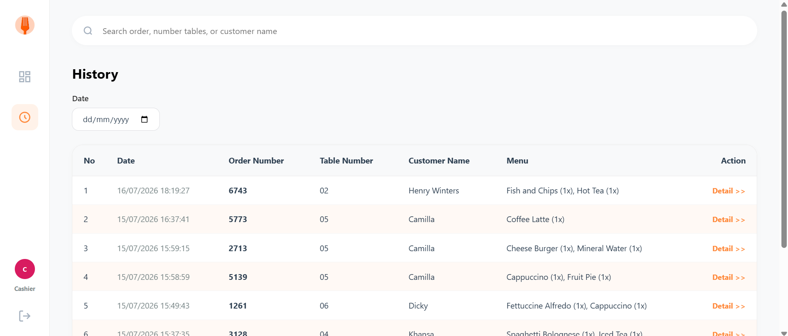

# Restaurant Ordering System

A role-based web application for restaurant order management developed using **HTML, CSS, JavaScript, PHP, and MySQL**. The system streamlines the ordering process by providing separate interfaces for customers, kitchen staff, and cashiers.

## Features

### Customer
- Place food and beverage orders
- View order details
- Track order progress in real time

### Kitchen
- View incoming order queue
- Monitor payment status
- Access order history
- Search orders by keyword
- Filter order history by date

### Cashier
- View payment queue
- Process customer payments
- Access order history
- Search orders by keyword
- Filter transactions by date

## User Roles

| Role | Permissions |
|------|-------------|
| Customer | Create orders, view order details, track order status |
| Kitchen | View order queue, update order workflow, access order history |
| Cashier | Manage payment queue, process payments, access transaction history |

## Tech Stack

- HTML
- CSS
- JavaScript
- PHP
- MySQL

## Screenshots

### Customer Login


### Employee Login


### Customer Dashboard


### Customer Ordering Page


### Kitchen Dashboard


### Kitchen Order History


### Cashier Dashboard


### Cashier Order History


## Database

Import the SQL file located in the `database/` folder before running the application.

## Installation

1. Clone this repository.

```bash
git clone https://github.com/yourusername/restaurant-ordering-system.git
```

2. Move the project folder to your XAMPP `htdocs` directory.

3. Start **Apache** and **MySQL** using XAMPP.

4. Import the database file from the `database/` folder into phpMyAdmin.

5. Configure the database connection in the PHP configuration file.

6. Open the application in your browser:

```
http://localhost/restaurant-ordering-system
```

## Project Structure

```
restaurant-ordering-system/
│
├── css/
├── images/
├── screenshots/
│
├── database/
│   └── restaurant_db.sql
│
├── index.php
├── login_customer.php
├── login_employee.php
├── logout.php
├── dashboard_cashier.php
├── dashboard_kitchen.php
├── menu.php
├── order_detail_view.php
├── order_history.php
├── order_history_cashier.php
│
├── README.md
```

## Future Improvements

- Online payment integration
- Email order notifications
- Admin role (Manage employee accounts and add/delete menu)
- Sales analytics dashboard
- Responsive mobile interface

## License

This project was developed for educational purposes.
